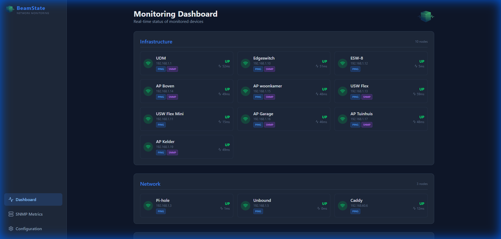
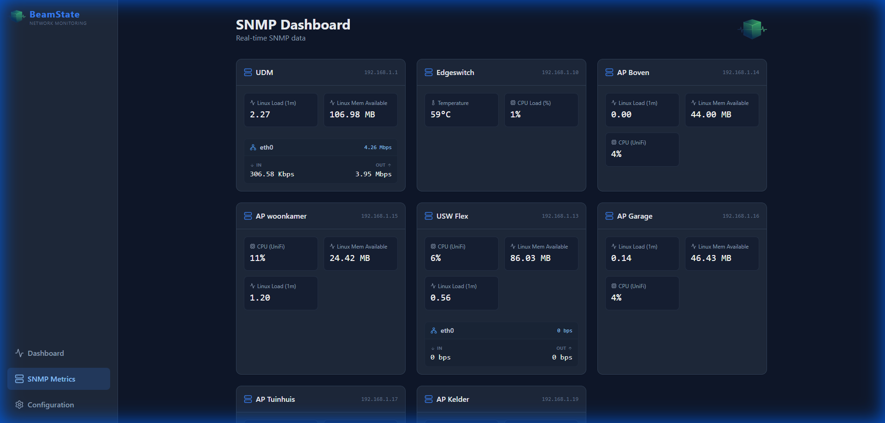

<p align="center">
    
</p>

# BeamState Network Monitor

A real-time network monitoring application that pings configured nodes, monitors SNMP metrics (Cpu, Memory, Traffic, etc.), and displays their status on a dashboard.

## Features

- **Real-time Monitoring**: Async pinging with configurable intervals.
- **SNMPv2c Support**: Monitor generic and specific OIDs (Interface Traffic, CPU, Memory, Uptime).
- **Customizable Metrics**: Define your own OIDs in `backend/snmp.json` and configure them via the UI.
- **Enhanced Network Discovery**: Scan subnets for ICMP and SNMP devices, merging results intelligently with existing configurations.
- **Modern Dashboard**: Dark-themed UI showing node status, latency, SNMP availability, and detailed metrics.
- **Web-Based Configuration**: Add, edit, and remove groups/nodes/metrics directly from the UI.
- **Flexible Storage**: SQLite for configuration/cache, optional InfluxDB for time-series data.
- **Bootstrap Config**: Define initial topology in `config.json` for automatic seeding.
- **Smart Notifications**: Integrated Pushover alerts with priority management and intelligent storm throttling.

## Screenshots

### Dashboard

*Real-time monitoring dashboard showing node status, latency, and protocol availability*

### SNMP Metrics

*Detailed SNMP metric visualization for configured devices*


## Quick Start (Windows)

The easiest way to run the application locally on Windows is via the provided PowerShell script.

1. **Clone the repository**
   ```bash
   git clone https://github.com/yourusername/BeamState.git
   cd BeamState
   ```

2. **Configure the Application**
   ```bash
   cd backend
   cp config.json.example config.json
   # Edit config.json with your settings (InfluxDB, network topology, etc.)
   ```
   
   **Important**: The `config.json` file contains sensitive data (InfluxDB tokens, network topology). It is gitignored and will not be committed to version control.

3. **Start the Application**
   Open PowerShell as **Administrator** (required for ICMP Ping) and run:
   ```powershell
   .\start-app.ps1
   ```
   This script will:
   - Check and stop any existing instances on ports 8000/5173.
   - Start the Backend (Uvicorn) on port 8000.
   - Start the Frontend (Vite) on port 5173.

4. **Open the Application**
   - Frontend: [http://localhost:5173](http://localhost:5173)
   - Backend API: [http://localhost:8000](http://localhost:8000)
   - API Docs: [http://localhost:8000/docs](http://localhost:8000/docs)

## Documentation

- [**Grafana Guide**](GRAFANA_GUIDE.md): Detailed instructions for setting up Grafana dashboards and alerts for BeamState.

## Docker Deployment

For containerized deployment (e.g., on Proxmox LXC), use Docker Compose.
**See [release_plan.md](release_plan.md) for detailed LXC/hardware specs.**

### 1. Installation

1.  **Clone the Repository**
    ```bash
    git clone https://github.com/straybiker/BeamState.git
    cd BeamState
    ```

2.  **Configure Application**
    Docker mounts the `backend/config.json` file. You must create this before starting.
    ```bash
    cd backend
    cp config.json.example config.json

    # Optional. You can do it from the UI later
    nano config.json 
    # Add your network topology and InfluxDB settings here
    cd ..
    ```

3.  **Start Services**
    ```bash
    docker compose up -d --build
    ```

### 2. Upgrading / Redeploying

When you have new code (e.g., from `git pull`):

```bash
# 1. Get latest code
git pull

# 2. Rebuild and restart containers
# --force-recreate is important to ensure the frontend picks up new configs
docker compose up -d --build --force-recreate
```

### 3. Access
- **Frontend**: `http://<YOUR_IP>:3000`
- **Backend API**: `http://<YOUR_IP>:8000`

### 4. Data Persistence
- **Logs & Data**: Stored in `./backend/data/` (mapped to host).
- **Configuration**: Stored in `./backend/config.json`.
- **InfluxDB**: If external, data is stored on your InfluxDB instance (not in these containers).

## Configuration

### Initial Setup
1. Copy `backend/config.json.example` to `backend/config.json`
2. Configure your InfluxDB connection (optional but recommended for time-series data)
3. Define your initial network topology (groups and nodes)
4. Adjust logging preferences

### Application Config (`app_config`)
The `app_config` section in `config.json` contains global settings:
- **InfluxDB**: Connection details for time-series storage (can also be configured via UI)
- **Logging**: File logging settings and retention policy

### Network Topology
The `groups` and `nodes` arrays define your network. On startup, the database syncs with this file.

### SNMP Metrics (`snmp.json`)
Default SNMP metric definitions are stored in `backend/snmp.json`. You can add custom OIDs here.
- **oid_template**: Use `{index}` placeholder for interface metrics.
- **requires_index**: Set to `true` if the user needs to specify an index (e.g., Interface ID) or `false` for scalar values (like System Uptime).

### Notifications (New)
BeamState supports **Pushover** for mobile push notifications.
- **Setup**: Configure your User Key and API Token in the "Settings" tab.
- **Priority**: choose from -2 (Lowest) to 2 (Emergency). Emergency priority includes automatic retry (60s) and expiration (1h).
- **Smart Throttling**: 
  - Prevents "alert fatigue" during major network outages.
  - If more than **X** nodes fail within **Y** seconds (configurable), individual alerts are paused.
  - A single **Global Alert** summary is sent instead.

Example:
```json
{
    "name": "Custom Temp",
    "oid_template": "1.3.6.1.4.1.9.9.13.1.3.1.3.{index}",
    "metric_type": "gauge",
    "unit": "celsius",
    "category": "environment",
    "device_type": "cisco",
    "requires_index": true
}
```

## Tech Stack

- **Backend**: Python 3.11+, FastAPI, SQLAlchemy, pysnmp-lextudio, ping3.
- **Frontend**: React, Vite, Tailwind CSS, Lucide Icons.
- **Database**: SQLite.

## Project Structure

```
BeamState/
├── backend/
│   ├── main.py             # App entry point
│   ├── snmp.json           # Default SNMP definitions
│   ├── config.json         # Network topology
│   ├── monitors/           # Ping and SNMP monitor logic
│   ├── routers/            # API endpoints
│   └── data/               # SQLite DB
├── frontend/
│   ├── src/components/     # React components
│   └── public/             # Assets
171: └── start-app.ps1           # Startup script
```

## Recent Improvements

### ✅ Completed
- **Smart Node Import** - Merges found protocols (ICMP/SNMP) into existing nodes without data loss.
- **Enhanced Discovery UI** - Visual protocol badges and strict import filters based on scan settings.
- **InfluxDB Integration** - Full support for time-series data storage with UI configuration.
- **SNMP Metric Persistence** - Detailed metrics (CPU, Traffic) written to InfluxDB.
- **Configurable Logging** - File logging with retention policy, separate system and runtime logs.
- **Security Hardening** - Sensitive data removed from Git, API token masking.
- **Pushover Notifications** - Configurable push alerts for node DOWN events with priority and custom templates.
- **Smart Throttling** - Intelligent suppression of alert storms during general outages.

## Roadmap

### Configuration UI
- [ ] **Max Retries Config** - Expose `max_retries` setting in UI (currently only in config.json)
- [ ] **Timeout Config** - Expose ping/SNMP timeout settings in UI (currently hardcoded to 5s)
- [ ] **SNMP Version Config** - Expose SNMP version setting in UI (currently v2c only)

### Dashboard
- [ ] **Collapseable groups** - Add collapseable groups in dashboard
- [ ] **Drag and drop nodes** - Add drag and drop functionality to move nodes in a group

### Notifications
- [x] **Pushover Support** - Add Pushover integration for push notifications on node status changes
- [x] **Smart Throttling** - Prevent alert spam during mass outages

### UI/UX Improvements
- [ ] **Mobile Config Layout** - Fix node configuration table wrapping on mobile devices (too small)
- [ ] **Auto-fill Group Interval** - When selecting a group in node config, auto-populate the group's default interval


## License

MIT License
