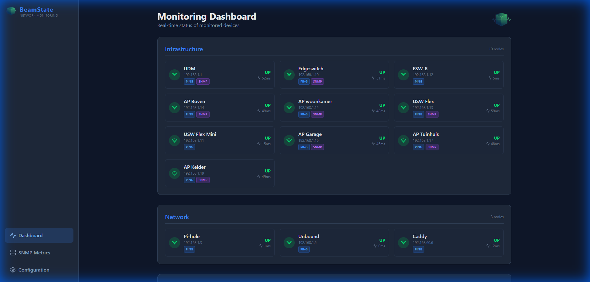
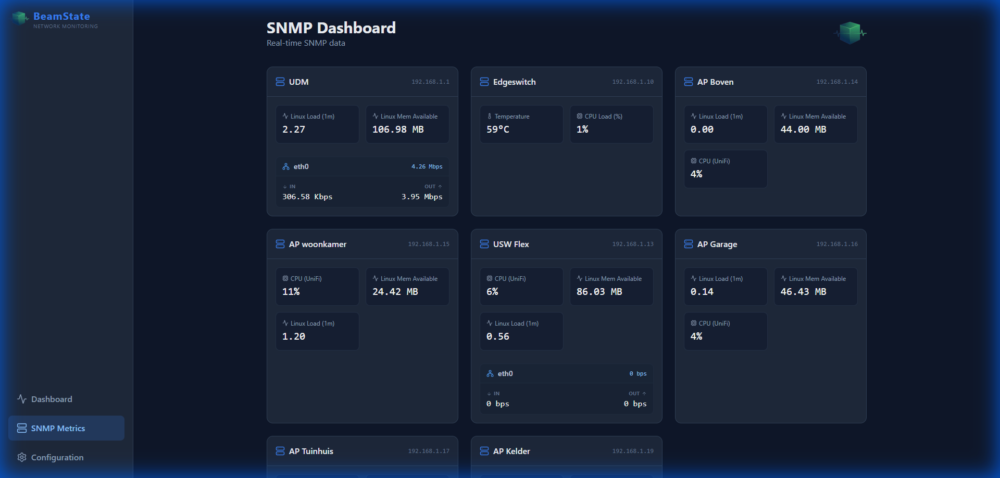

<p align="center">
    
</p>

# BeamState Network Monitor

A real-time network monitoring application that pings configured nodes, monitors SNMP metrics (Cpu, Memory, Traffic, etc.), and displays their status on a dashboard.

## Features

- **Real-time Monitoring**: Async pinging with configurable intervals.
- **SNMPv2c Support**: Monitor generic and specific OIDs (Interface Traffic, CPU, Memory, Uptime).
- **Customizable Metrics**: Define your own OIDs in `backend/snmp.json` and configure them via the UI.
- **Enhanced Network Discovery**: Scan subnets for ICMP and SNMP devices, merging results intelligently with existing configurations.
- **Modern Dashboard**: Dark-themed UI showing node status, latency, SNMP availability, and detailed metrics.
- **Web-Based Configuration**: Add, edit, and remove groups/nodes/metrics directly from the UI.
- **Flexible Storage**: SQLite is the source of truth for topology, metric config and history. Optional InfluxDB for long-term time-series data.
- **Bootstrap and Backup**: `config.json` seeds an empty database and is rewritten as an export after every change. `GET /config/export` and `POST /config/import` move a topology between hosts.
- **Smart Notifications**: Pushover and generic JSON webhook (ntfy, Discord, Home Assistant) with priority management, storm throttling and recovery messages.
- **Degraded State**: A reachable node with a metric outside its thresholds is DEGRADED, not DOWN. Metric alerts can require N consecutive samples before they raise.
- **Dependencies**: Give a node a parent. While the parent is DOWN, the child's DOWN alert is suppressed.
- **State History**: Every status change is stored in SQLite with configurable retention and shown on the Trace page.
- **Heartbeat**: Optional deadman ping to Healthchecks.io, Uptime Kuma or Home Assistant so you notice when BeamState itself stops.

## Screenshots

### Dashboard

*Real-time monitoring dashboard showing node status, latency, and protocol availability*

### SNMP Metrics

*Detailed SNMP metric visualization for configured devices*


## Quick Start (Windows)

The easiest way to run the application locally on Windows is via the provided PowerShell script.

1. **Clone the repository**
   ```bash
   git clone https://github.com/yourusername/BeamState.git
   cd BeamState
   ```

2. **Configure the Application**
   ```bash
   cd backend
   cp config.json.example config.json
   # Edit config.json with your settings (InfluxDB, network topology, etc.)
   ```
   
   **Important**: The `config.json` file contains sensitive data (InfluxDB tokens, network topology). It is gitignored and will not be committed to version control.

3. **Start the Application**
   Open PowerShell and run (Administrator is only needed if ICMP raw sockets are blocked on your Windows build):
   ```powershell
   .\start-app.ps1
   ```
   This script will:
   - Check and stop any existing instances on ports 8000/5173.
   - Start the Backend (Uvicorn) on port 8000.
   - Start the Frontend (Vite) on port 5173.

4. **Open the Application**
   - Frontend: [http://localhost:5173](http://localhost:5173)
   - Backend API: [http://localhost:8000](http://localhost:8000)
   - API Docs: [http://localhost:8000/docs](http://localhost:8000/docs)

## Documentation

- [**Grafana Guide**](GRAFANA_GUIDE.md): Detailed instructions for setting up Grafana dashboards and alerts for BeamState.

## Docker Deployment

For containerized deployment (e.g., on Proxmox LXC), use Docker Compose. Both containers carry healthchecks; the frontend waits for a healthy backend.

### 1. Installation

1.  **Clone the Repository**
    ```bash
    git clone https://github.com/straybiker/BeamState.git
    cd BeamState
    ```

2.  **Configure Application**
    Docker mounts the `backend/config.json` file. You must create this before starting.
    ```bash
    cd backend
    cp config.json.example config.json

    # Optional. You can do it from the UI later
    nano config.json 
    # Add your network topology and InfluxDB settings here
    cd ..
    ```

3.  **Start Services**
    ```bash
    docker compose up -d --build
    ```

### 2. Upgrading / Redeploying

Run this on the Proxmox host (inside the LXC) from the repository directory.

```bash
# 1. Back up the database and the config file (see Data Persistence for the online backup)
docker exec beamstate-backend python -c "import sqlite3; s=sqlite3.connect('/app/data/beamstate.db'); d=sqlite3.connect('/app/data/beamstate.backup.db'); s.backup(d); d.close()"
cp backend/config.json backend/config.json.bak

# 2. Get the latest code
git pull

# 3. Rebuild and restart
# --force-recreate ensures the frontend picks up new configs
docker compose up -d --build --force-recreate

# 4. Verify
docker compose ps                      # both containers "healthy" within about a minute
docker compose logs -f backend         # Ctrl+C to stop following
```

Schema migrations run automatically at startup. Nothing needs to be done by hand for the database.

**First start after upgrading to the source-of-truth release**, expect these log lines and actions:

1. `Import policy: config.json modified after last export, importing` followed by `Import complete`. The old-format file is imported once (an upsert of what is already in the database) and rewritten with `exported_at` and the metric configuration. Later restarts skip the import.
2. Open **Configuration → Groups** and re-enter any group-level SNMP settings (community, port, protocol flags). Earlier releases reset them to defaults on every restart; from now on they persist.
3. Open **Configuration → Metrics** and set **Samples** to 2 or 3 on noisy metrics such as ICMP Latency. Existing metrics keep 1, which alerts on a single spike.
4. Nodes with a metric outside its thresholds now show **DEGRADED** instead of DOWN. Review thresholds that were tuned around the old behaviour.
5. Optional, under **Configuration → Settings**: enable the webhook channel, the heartbeat, and check the history retention values.

If something goes wrong, roll back with the backups from step 1:

```bash
docker compose down
cp backend/data/beamstate.backup.db backend/data/beamstate.db
cp backend/config.json.bak backend/config.json
git checkout <previous-commit>
docker compose up -d --build --force-recreate
```

### 3. Access
- **Frontend**: `http://<YOUR_IP>:3000`
- **Backend API**: `http://<YOUR_IP>:8000` (Swagger at `/docs`)

The API has no authentication yet. Keep both ports on the LAN or behind a reverse proxy with its own authentication.

### 4. Data Persistence
Both the database and the configuration file live on the host through bind mounts, so they survive `docker compose up -d --build --force-recreate`.

| Host path | Contents | Role |
|---|---|---|
| `./backend/data/beamstate.db` | groups, nodes, dependencies, metric config, discovered interfaces, state history, metric samples | **source of truth** |
| `./backend/config.json` | export of the topology and metric config plus `app_config` (settings and secrets) | mirror and backup, rewritten after every change |
| `./backend/data/alert_states.json`, `system.log*`, `logs.json` | active metric alert levels, application log, monitoring data log | runtime state |

- **Fresh volume or lost database**: the import policy sees an empty database and rebuilds groups, nodes, dependencies and metric configuration from `config.json`. Only history tables (state events, metric samples) are lost.
- **Keep the mount on local disk.** SQLite does not work reliably on NFS or SMB shares because of file locking. A bind mount inside a Proxmox LXC is fine.
- **Backups**: a Proxmox snapshot or backup of the LXC covers everything. To copy the database by hand while the container runs, use SQLite's online backup so you never copy a half-written file:
  ```bash
  docker exec beamstate-backend python -c "import sqlite3; s=sqlite3.connect('/app/data/beamstate.db'); d=sqlite3.connect('/app/data/beamstate.backup.db'); s.backup(d); d.close()"
  ```
- **Size**: metric samples are the only fast-growing table, roughly 1,500 rows per metric per day, pruned after `history.metric_retention_days` (default 3). Expect tens of megabytes.
- **InfluxDB**: if enabled, time-series data is stored on your InfluxDB instance (not in these containers).

## Configuration

### Initial Setup
1. Copy `backend/config.json.example` to `backend/config.json`
2. Configure your InfluxDB connection (optional but recommended for time-series data)
3. Define your initial network topology (groups and nodes)
4. Adjust logging preferences

### Application Config (`app_config`)
The `app_config` section in `config.json` contains global settings:
- **InfluxDB**: Connection details for time-series storage (can also be configured via UI)
- **Logging**: File logging settings and retention policy

### Network Topology
The **database is the source of truth**. `config.json` is an export of it: groups, nodes, dependencies and metric configuration, rewritten after every change in the UI and at startup. Treat the file as a backup you can copy to another host.

- `GET /config/export` returns the same document without secrets.
- `POST /config/import` upserts a document into the database. Nothing is deleted. Nodes that carry a `metrics` list get their metric configuration replaced, matched to definitions by name.
- At startup `should_import_config()` in `backend/cleanup.py` decides whether the file is imported before the export runs. It imports in three cases: the file contains `"import": true` (consumed on the next start), the database has no groups yet, or the file was modified more than 5 seconds after its `exported_at` timestamp (hand edit or restored backup). A file without `exported_at` is imported once and rewritten in the new format.

### Reliability and Reboots
- `GET /trace/availability?windows=24,720` returns availability, downtime and DOWN count per node, computed from the state history. PENDING is not counted as downtime, PAUSED time is excluded. The dashboard shows the 24 h value per node, the Trace page lists the least available nodes.
- SNMP nodes report **reboots**: a `sysUpTime` lower than the previous reading raises a `node_reboot` notification with the previous uptime. Toggle under Settings.

### Metric History
Every processed metric value is kept in `metric_samples` for `history.metric_retention_days` (default 3). `GET /metrics/history?hours=6&points=48` returns bucketed averages that feed the sparklines on the Metrics page. InfluxDB remains the choice for long-term trends.

### Live Dashboard
The dashboard subscribes to `GET /status/stream` (SSE). Each completed check pushes one node result; configuration changes push a `config` event so the page refetches groups and settings. Polling every 15 s stays as a fallback while the stream is disconnected.

### SNMP Metrics (`snmp.json`)
Default SNMP metric definitions are stored in `backend/snmp.json`. You can add custom OIDs here.
- **oid_template**: Use `{index}` placeholder for interface metrics.
- **requires_index**: Set to `true` if the user needs to specify an index (e.g., Interface ID) or `false` for scalar values (like System Uptime).

Example:
```json
{
    "name": "Custom Temp",
    "oid_template": "1.3.6.1.4.1.9.9.13.1.3.1.3.{index}",
    "metric_type": "gauge",
    "unit": "celsius",
    "category": "environment",
    "device_type": "cisco",
    "requires_index": true
}
```

### Node States
| State | Meaning |
|---|---|
| UP | Reachable, all metrics within thresholds |
| DEGRADED | Reachable, at least one metric in WARNING or CRITICAL |
| PENDING | A reachability check failed, retrying at 1/3 of the interval |
| DOWN | Retries exhausted |
| PAUSED | Node or group disabled |

### Notifications
Two channels, both driven from the "Settings" tab:
- **Pushover**: User Key and API Token, priority -2 (Lowest) to 2 (Emergency, with retry every 60 s for 1 h). Per-node priority overrides the global value.
- **Webhook**: JSON POST to any URL. Payload fields: `source`, `event` (`node_down`, `node_up`, `metric_warning`, `metric_critical`, `metric_resolved`, `alert_storm`), `title`, `message`, `priority`, `timestamp`, plus `node`, `ip`, `group`, `status` or metric details.
- **Recovery messages**: When a DOWN node is reachable again, a message with the downtime is sent. Disable under Settings if you only want failures.
- **Maintenance Mode**: Suppresses every channel.
- **Smart Throttling**: If more than **X** nodes fail within **Y** seconds, individual alerts pause and one summary is sent.
- **Dependencies**: Set "Depends on" for a node. A DOWN parent suppresses the child's DOWN alert and its recovery message.

### Metric Alerts
Per metric: condition (above/below), warning and critical thresholds, and **Samples**, the number of consecutive breaching samples before the alert raises. Recovery is immediate with a 5 % hysteresis band. Existing metrics keep 1 sample; set 2 or 3 on noisy metrics such as ICMP latency.

### Heartbeat
Enable under Settings with a ping URL (Healthchecks.io, Uptime Kuma push, Home Assistant webhook). BeamState sends a GET on the configured interval. The receiving service alerts you when the pings stop.

### State History
Every status transition is written to the `state_events` table and served by `GET /trace/events?limit=&node_id=&hours=`. Retention in days is set under Settings (0 keeps everything).

## Tech Stack

- **Backend**: Python 3.11+, FastAPI, SQLAlchemy, pysnmp 7, ping3.
- **Frontend**: React, Vite, Tailwind CSS, Lucide Icons.
- **Database**: SQLite (`backend/data/beamstate.db`, override with the `DB_PATH` environment variable).
- **CI**: GitHub Actions runs the backend tests, frontend lint and build, and both Docker builds on every push and merge request.

## Development

```bash
cd backend && TESTING=1 python -m pytest tests -q
cd frontend && npm run lint && npm run build
```

`TESTING=1` switches the backend to an in-memory database and disables the monitor loop.

## Project Structure

```
BeamState/
├── backend/
│   ├── main.py             # App entry point, SSE status stream
│   ├── monitor_manager.py  # Node state machine, alerts, reboot detection, heartbeat
│   ├── metrics_processor.py# Thresholds, sample counting, metric history
│   ├── notifications.py    # Pushover, webhook, Notifier facade
│   ├── availability.py     # Uptime statistics from state history
│   ├── cleanup.py          # Import policy and config.json import
│   ├── utils.py            # Export to config.json
│   ├── snmp.json           # Default SNMP metric definitions
│   ├── config.json         # Export of the database + app settings (gitignored)
│   ├── monitors/           # Ping, SNMP health check, SNMP collector
│   ├── routers/            # API endpoints
│   ├── migrations/         # Schema updates applied at startup
│   ├── tests/              # pytest suite
│   └── data/               # SQLite DB, alert state, logs (bind-mounted)
├── frontend/
│   ├── src/components/     # React components
│   └── public/             # Assets
├── .github/workflows/      # CI
├── docker-compose.yml
└── start-app.ps1           # Local dev startup (Windows)
```

## Recent Improvements

### ✅ Completed
- **Database as source of truth** - config.json is an export with metric configuration; import/export endpoints; startup import policy.
- **DEGRADED state, sample counting, recovery and reboot notifications, parent dependencies, webhook channel, heartbeat.**
- **State history and availability** - Persisted transitions, uptime % per node, reliability table.
- **Metric history and sparklines** - Short-term SQLite samples behind the Metrics page.
- **Live dashboard over SSE** - One push per check instead of polling.
- **pysnmp 7 migration and dependency fixes** - Builds again with pyasn1 0.6 and starlette 1.x.
- **Per-Node Alert Priority** - Override global notification priority on individual nodes.
- **Security Hardening** - Fixed secret leakage in API responses, dependency CVE patches.
- **Enhanced Discovery UI** - Visual protocol badges and strict import filters based on scan settings.
- **InfluxDB Integration** - Full support for time-series data storage with UI configuration.
- **Configurable Logging** - File logging with retention policy, separate system and runtime logs.
- **Pushover Notifications** - Configurable push alerts for node DOWN events with priority and custom templates.

## Roadmap

### Configuration UI
- [ ] **Max Retries Config** - Expose `max_retries` setting in UI (currently only in config.json)
- [ ] **Timeout Config** - Expose ping/SNMP timeout settings in UI (currently hardcoded to 5s)
- [ ] **SNMP Version Config** - Expose SNMP version setting in UI (currently v2c only)

### Dashboard
- [ ] **Collapseable groups** - Add collapseable groups in dashboard
- [ ] **Drag and drop nodes** - Add drag and drop functionality to move nodes in a group

### Notifications
- [x] **Pushover Support** - Add Pushover integration for push notifications on node status changes
- [x] **Smart Throttling** - Prevent alert spam during mass outages
- [x] **Webhook channel, recovery messages, parent dependencies, heartbeat**
- [ ] **Scheduled maintenance windows** - Per-group windows with start and end time

### Coverage
- [ ] **Service checks** - TCP port, HTTP status and DNS monitors next to ICMP and SNMP
- [ ] **API authentication** - Required before exposing the UI outside the LAN

### UI/UX Improvements
- [ ] **Mobile Config Layout** - Fix node configuration table wrapping on mobile devices (too small)
- [ ] **Auto-fill Group Interval** - When selecting a group in node config, auto-populate the group's default interval

## License

MIT License
